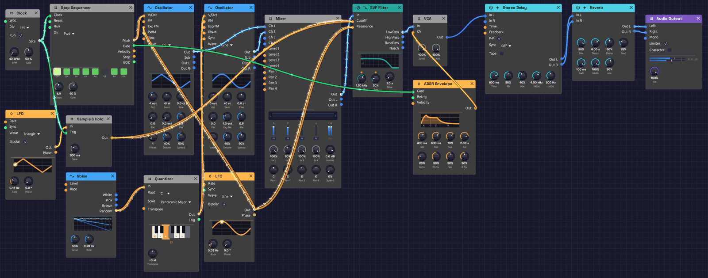

# Generative Ambient

A patch that plays itself. A slow pentatonic melody repeats every twelve seconds, but its brightness shifts in threes against it, and a second voice wanders around it, never taking the same path twice. The tuning drifts, and long echoes and an eight-second reverb blur one phrase into the next. Press Play and leave it running.

> **Load it:** choose **📚 Examples → Generative Ambient** in the toolbar and press **▶ Play**. It needs no keyboard.
> The patch file is [`patches/generative-ambient.json`](https://github.com/chrischaps/Modular/blob/master/patches/generative-ambient.json).

<iframe class="patch-embed" src="../play/?patch=generative-ambient" title="Generative Ambient, playable in the browser" loading="lazy"></iframe>
*Or play it here: press **▶ Play** in the corner. The full app is a click away under **Open in Modular**.*


*Clock and sequencer play the melody, top left, with the Clock Divider under the Clock. Below, the LFO and Sample & Hold set the brightness, and Noise and the Quantizer sing the second voice.*

## What it teaches

- **Clock and sequencer.** A clock sets the pace and a step sequencer turns each pulse into a note.
- **Sample & hold.** Freezing a moving signal at a pulse gives each group of notes its own setting, a step at a time.
- **Cycles that don't line up.** When loops of different lengths run against each other, the combination takes a very long time to repeat. That's where the brightness gets its variety.
- **Chance, in key.** A quantizer snaps a random voltage to the notes of a scale, so chance can write a melody without a wrong note.

## Modules

| Module | Settings |
|--------|----------|
| [Clock](../modules/modulation/clock.md) | **BPM** 40, **Div** 1/4 |
| [Step Sequencer](../modules/utilities/sequencer.md) | **Steps** 8, **Dir** Fwd, **Gate** 60%, **Gate of** 100 ms. Notes C4 D4 E4 G4 A4 G4 E4 D4, step 6 off |
| [Oscillator](../modules/sources/oscillator.md) 1 | **Wave** Tri, **Oct** −1, **Exp FM** 0.01 oct |
| [Oscillator](../modules/sources/oscillator.md) 2 | **Wave** Sine |
| [Noise](../modules/sources/noise.md) | **Rate** 0.2 Hz |
| [Quantizer](../modules/utilities/quantizer.md) | **Root** C, **Scale** Pentatonic Major |
| [Mix](../modules/utilities/mix.md) | **Level 1** 100%, **Level 2** 50% |
| [SVF Filter](../modules/filters/svf-filter.md) | **Cutoff** 1.5 kHz, **Res** 20% |
| [ADSR Envelope](../modules/modulation/adsr.md) | **Atk** 300 ms, **Dec** 500 ms, **Sus** 70%, **Rel** 2 s |
| [VCA](../modules/utilities/vca.md) | Defaults |
| [LFO](../modules/modulation/lfo.md) 1 | **Rate** 0.13 Hz, **Wave** Triangle, **Bipolar** on |
| [Clock Divider](../modules/utilities/divider.md) | **Div** 3 |
| [Sample & Hold](../modules/utilities/sample-hold.md) | **Slew** 300 ms |
| [LFO](../modules/modulation/lfo.md) 2 | **Rate** 0.03 Hz, **Wave** Sine, **Bipolar** on |
| [Stereo Delay](../modules/effects/delay.md) | **Time** 600 ms, **FB** 50%, **Mix** 40%, **HiCut** 4 kHz, **LoCut** 200 Hz, **P-P** on |
| [Reverb](../modules/effects/reverb.md) | **Size** 90%, **Decay** 8 s, **PreD** 100 ms, **Mix** 60% |
| [Audio Output](../modules/output/audio-output.md) | **Vol** 100% |

## How it's built

### The melody

```text
[Clock Gate] ──> [Step Sequencer Clock]
[Step Sequencer Pitch] ──> [Oscillator 1 V/Oct]
[Step Sequencer Gate] ──> [ADSR Gate]
```

At 40 BPM with **Div** at 1/4, the Clock pulses once a beat, every 1.5 seconds. Each pulse moves the sequencer one step. Its eight steps rise and fall through a C major pentatonic scale, C D E G A G E D, and step 6's gate is off, so the melody takes a breath before it turns around. Eight steps of 1.5 seconds make a twelve-second loop.

The pentatonic scale has no half steps, so no two of its notes clash. That's why the long echoes and reverb can pile notes on top of each other without the result turning muddy.

Oscillator 1 plays the melody as a triangle, an octave down: a soft, hollow tone, closer to a flute or a mallet than to a synth lead.

### A second voice, by chance

```text
[Noise Random] ──> [Quantizer In]
[Quantizer Out] ──> [Oscillator 2 V/Oct]
[Oscillator 1 Out] ──> [Mix In 1]
[Oscillator 2 Out] ──> [Mix In 2]
[Mix Out] ──> [SVF Filter In]
```

The Noise module's **Random** output picks a new value every five seconds or so, and glides to it. On its own, that would bend Oscillator 2's pitch smoothly through every frequency in between. The Quantizer snaps it to the C major pentatonic scale, the same five notes the melody uses, so the glide becomes a walk: one scale step at a time, up or down, from C3 to C5.

This voice keeps its own time. Its notes change when the random walk crosses from one note to the next, not on the clock, so it slips in between the melody's notes and sometimes holds on through several. Because both voices stay in the pentatonic scale, any note of one sounds right against any note of the other. Oscillator 2 is a sine, mixed in at half level, so it sits behind the melody like a singer humming along.

The mini piano on the Quantizer lights the five notes of the scale and follows the note it's playing.

### Brightness in threes

```text
[Clock Gate] ──> [Clock Divider Clock]
[Clock Divider Trig] ──> [Sample & Hold Trig]
[LFO 1 Out] ──> [Sample & Hold In]
[Sample & Hold Out] ──> [SVF Filter Cutoff]
```

LFO 1 is a slow triangle, one cycle every 7.7 seconds. The Clock Divider passes on every third clock pulse, and on each one the Sample & Hold catches the LFO's current value and holds it. The filter's **Cutoff** input works in octaves, so each group of three notes gets a cutoff somewhere between 750 Hz and 3 kHz. The 300 ms **Slew** glides between values instead of jumping.

Three doesn't go into the melody's eight. The first pass is shaded 3 + 3 + 2, the next starts its groups one note later, and the groups only fall on the same notes again after three passes, 36 seconds. On top of that, the LFO's 7.7-second cycle divides evenly into none of them. So the melody repeats exactly, but its shading never does: every pass comes out lit differently, in phrases that cut across the melody's own.

### Slow drift

```text
[LFO 2 Out] ──> [Oscillator 1 Exp FM]
            ──> [SVF Filter Resonance]
```

LFO 2 takes over half a minute per cycle. On Oscillator 1's **Exp FM** input, with **Exp FM** set to 0.01 octave, it bends the pitch about 12 cents sharp and flat. Against the steady Oscillator 2, that makes a slow beating, like an instrument that's not quite in tune with itself. The same LFO raises and lowers the filter's resonance, so some passages ring and others are soft.

### Envelope, echoes and space

```text
[SVF Filter LowPass] ──> [VCA In]
[ADSR Out] ──> [VCA CV]
[VCA Out] ──> [Stereo Delay In L]
[Stereo Delay Out L] ──> [Reverb In L]
[Stereo Delay Out R] ──> [Reverb In R]
[Reverb Out L] ──> [Audio Output Left]
[Reverb Out R] ──> [Audio Output Right]
```

The envelope's 300 ms attack takes the edge off each note and its 2-second release lets it ring into the next one. The Stereo Delay repeats every 600 ms with **Ping-Pong** on, so echoes bounce between the speakers. Its **HiCut** and **LoCut** darken and thin each repeat, so the echoes recede instead of building up. The Reverb's large room and 8-second tail turn it all into a wash.

## Variations

**Really generative.** Set the sequencer's **Dir** to Rnd. The notes now come in a random order, and because they're all from the pentatonic scale, every order works.

**A busier second voice.** Raise the Noise **Rate** to 1 Hz and the second voice runs up and down the scale. Turn it down to 0.05 Hz and it becomes a slowly changing drone.

**Bend the scale.** Click keys on the Quantizer's piano. Take out E and A for a bare, open C D G, or add B for six notes and a little more tension. Only the second voice changes; the melody stays where it is.

**Rewrite the melody.** Click a step to turn its gate on or off. Drag a step up or down to change its note, or right-click it and play a new line on its piano. Stay on C, D, E, G and A to keep the pentatonic calm.

**An odd-length loop.** Set **Steps** to 5 or 7 so the phrase falls out of step with the bar.

**Other groupings.** Set the Clock Divider's **Div** to 1 and every note gets its own brightness. Try 5 against the eight notes for a longer cycle, or 4 for shading that lines up with the melody's two halves.

**Slower still.** Turn the Clock down to 20 BPM, and raise the Reverb's **Decay** to 15 s or more.

**Tape echoes.** Turn on the delay's **Tape** for wobble and saturation in the repeats.

**Wider drift.** Raise Oscillator 1's **Exp FM** to 0.03 octave for a seasick, detuned-tape feel.

## Related

- [Sample & Hold](../modules/utilities/sample-hold.md) – stepped modulation
- [Clock Divider](../modules/utilities/divider.md) – every third pulse, and longer phrases
- [Quantizer](../modules/utilities/quantizer.md) – random pitches, in key
- [Step Sequencer](../modules/utilities/sequencer.md) – editing steps
- [Rhythmic Sequence](./rhythmic-sequence.md) – the same clock and sequencer, at dance tempo
- [Shoreline](./shoreline.md) – another patch that plays itself, where chance does the varying
