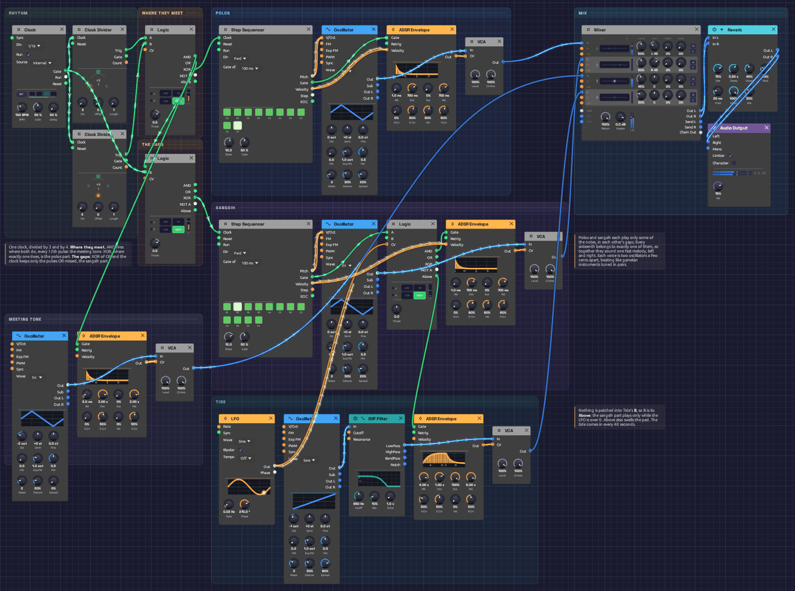

# Interlock

In a Balinese gamelan, the fastest melodies are played by two people at once. Neither plays the whole tune. One player, the *polos*, strikes some of the notes, and the other, the *sangsih*, strikes the notes in between. Played together, the two parts lock into one stream too quick for either player alone. This interlocking is called *kotekan*.

This patch plays a kotekan, and [Logic](../modules/utilities/logic.md) is what splits it. Two [Clock Dividers](../modules/utilities/divider.md) count the same sixteenth notes in threes and in fours. Logic decides, pulse by pulse, whose turn it is: a deep tone where the two rhythms meet, the polos where exactly one of them falls, and the sangsih in every gap that's left. Every sixteenth belongs to exactly one voice. A slow tide brings the sangsih in and takes it away again. It plays itself; press Play and let it run.

> **Load it:** choose **📚 Examples → Interlock** in the toolbar and press **▶ Play**. It needs no keyboard.
> The patch file is [`patches/interlock.json`](https://github.com/chrischaps/Soba/blob/master/patches/interlock.json).

<iframe class="patch-embed" src="../play/?patch=interlock" title="Interlock, playable in the browser" loading="lazy"></iframe>
*Or play it here: press **▶ Play** in the corner. The full app is a click away under **Open in Soba**.*


*The rhythm and its three Logic modules are on the left: Where they meet, The gaps, and Tide in the sangsih lane. The two players are the blue and violet lanes. The meeting tone is at the bottom left and the tide at the bottom. Captured at high tide, with both parts playing and the pad in.*

## What it teaches

- **AND, OR and XOR as musical decisions.** Two rhythms running against each other, three against four, become three different parts depending on how you ask about them.
- **The complement of a rhythm.** XOR a rhythm with the clock it came from and you get every pulse it didn't play. That's how the second player finds the gaps.
- **A normalled input.** Logic's **B** jack, left empty, listens to its own comparator. One module turns a slow LFO into a gate and lets notes through only while that gate is open.
- **Ombak.** Each voice is two oscillators a few cents apart, so every note shimmers. Gamelan instruments are tuned in pairs like this on purpose.

## The figure

Sixteenths at 100 BPM. The dividers fire every 3 and every 4 pulses, so the pattern of who plays repeats every 12. The melody takes two turns, 24 sixteenths, to come round.

```text
position   0  1  2  3  4  5  6  7  8  9 10 11 | 12 13 14 15 16 17 18 19 20 21 22 23
÷3         x        x        x        x       |  x        x        x        x
÷4         x           x           x          |  x           x           x
meeting    C                                  |  C
polos               C  D     G     D  C       |           A  G     C     C  A
sangsih       E  D        E     E        A  C |     D  C        A     D        G  A
```

Read the bottom three rows together, left to right, and you hear one melody: E D C D E G E D C A C, then D C A G A C D C A G A, with the deep C under each turn. Neither player has more than two notes in a row.

## Modules

| Module | Settings |
|--------|----------|
| [Clock](../modules/modulation/clock.md) | **BPM** 100, **Div** 1/16 |
| [Clock Divider](../modules/utilities/divider.md) ×2 | **Div** 3 and **Div** 4 |
| [Logic](../modules/utilities/logic.md) (Where they meet) | Defaults |
| [Logic](../modules/utilities/logic.md) (The gaps) | Defaults |
| [Step Sequencer](../modules/utilities/sequencer.md) (polos) | **Steps** 10, **Gate of** 100 ms, **Gate** 50%. Notes as in the figure; the four on the beat at velocity 112, the rest at 88 |
| [Step Sequencer](../modules/utilities/sequencer.md) (sangsih) | **Steps** 12, **Gate of** 100 ms, **Gate** 50%. Notes as in the figure, velocity 96 and 84 by turns |
| [Oscillator](../modules/sources/oscillator.md) ×2 (polos, sangsih) | **Wave** Tri, **Voices** 2, **Detune** 30%, **Spread** 20% |
| [ADSR Envelope](../modules/modulation/adsr.md) ×2 (polos, sangsih) | **Atk** 1 ms, **Dec** 700 ms, **Sus** 0%, **Rel** 700 ms, **Vel** 60% |
| [Logic](../modules/utilities/logic.md) (Tide) | **Thresh** 0, nothing in **B** |
| [Oscillator](../modules/sources/oscillator.md) (meeting tone) | **Wave** Tri, **Oct** -2, **Voices** 2, **Detune** 20% |
| [ADSR Envelope](../modules/modulation/adsr.md) (meeting tone) | **Atk** 3 ms, **Dec** 3 s, **Sus** 0%, **Rel** 3 s, **Vel** 0% |
| [LFO](../modules/modulation/lfo.md) (tide) | **Rate** 0.025 Hz, **Wave** Sine, **Phase** 270° |
| [Oscillator](../modules/sources/oscillator.md) + [SVF Filter](../modules/filters/svf-filter.md) (pad) | **Wave** Saw, **Oct** -1, **Voices** 3, **Detune** 30%, **Spread** 80%; LowPass, **Cutoff** 650 Hz, **Res** 10% |
| [ADSR Envelope](../modules/modulation/adsr.md) (pad) | **Atk** 4 s, **Dec** 1 s, **Sus** 100%, **Rel** 6 s |
| [VCA](../modules/utilities/vca.md) ×4 | Defaults |
| [Mixer](../modules/utilities/mixer.md) | **Level 1** 50% at L 45, **Level 2** 50% at R 45, **Level 3** 45%, **Level 4** 30% |
| [Reverb](../modules/effects/reverb.md) | **Size** 75%, **Decay** 3.5 s, **Damp** 45%, **PreD** 20 ms, **Mix** 30% |
| [Audio Output](../modules/output/audio-output.md) | **Vol** 75% |

## How it's built

### Two rhythms

```text
[Clock Gate] ──> [Clock Divider (÷3) Clock]
             ──> [Clock Divider (÷4) Clock]
```

One sixteenth-note Clock drives two dividers. Their **Trig** outputs are the Clock's own pulses: every third one, and every fourth one. On their own they're just two ticking patterns, three against four, meeting every twelfth pulse. Neither is a melody yet.

### Where they meet

```text
[÷3 Trig] ──> [Logic (meet) A]
[÷4 Trig] ──> [Logic (meet) B]
[Logic (meet) AND] ──> [Meeting tone Env Gate]
[Logic (meet) XOR] ──> [Polos Seq Clock]
```

The first Logic module asks three questions about the two rhythms at once. **AND** is high only where they fire together, on positions 0 and 12, and strikes the deep meeting tone. **XOR** is high where exactly one fires: positions 3, 4, 6, 8 and 9 of every twelve. That's the polos part, and it steps the polos sequencer. **OR**, where either fires, goes on to the next module.

### The gaps

```text
[Logic (meet) OR] ──> [Logic (gaps) A]
[Clock Gate] ──> [Logic (gaps) B]
[Logic (gaps) XOR] ──> [Sangsih Seq Clock]
```

The sangsih must play every pulse the others don't. Every OR pulse is also a Clock pulse, the same shape on the same sample. So XOR of the two is high only on the Clock pulses where OR is low: positions 1, 2, 5, 7, 10 and 11. That's the complement of a rhythm, and one Logic module finds it. The meeting tone, the polos and the sangsih now share out the sixteenths between them, with no pulse played twice and none skipped.

### Two players, one melody

```text
[Polos Seq Pitch] ──> [Polos Osc V/Oct]
[Polos Seq Gate] ──> [Polos Env Gate]
[Polos Osc Out] ──> [Polos VCA In]
(and the same for the sangsih)
```

Each part is its own sequencer, oscillator, envelope and VCA. A sequencer steps only when its part plays, so the polos sequencer holds the polos's 10 notes and the sangsih's holds its 12. Over two turns of the figure, 24 sixteenths, the two run through their notes exactly once and come back in step. Their notes are written so that, sounded together, they make one line. The sequencers use **Gate of: 100 ms** because their clocks are irregular: a fixed 50 ms strike suits a mallet better than a gate measured from uneven steps.

The two parts sit 45% left and 45% right in the mix. Listen on headphones and you can hear the melody pass from one side to the other, note by note.

Each oscillator plays two voices 9 cents either side of the note. They beat against each other about five times a second, a shimmer gamelan tuners call *ombak*, "wave". The meeting tone is tuned the same way but slower: its two voices drift in and out of phase every three seconds or so, like a gong's hum.

### The tide

```text
[Sangsih Seq Gate] ──> [Logic (tide) A]
[LFO Out] ──> [Logic (tide) CV]
[Logic (tide) AND] ──> [Sangsih Env Gate]
[Logic (tide) Above] ──> [Pad Env Gate]
```

The third Logic module has nothing patched into **B**, so B is its own **Above**: high while the LFO is above the **Threshold** of 0. **AND** then passes the sangsih's notes to its envelope only while the tide is in. The sangsih's sequencer keeps stepping either way. It's the sound that's gated, not the sequence, so when the tide comes back the sangsih comes in on the right note.

The LFO is a sine taking 40 seconds a cycle, starting at its lowest point. For the first 10 seconds you hear only the meeting tone and the polos, a sparse, syncopated pattern with gaps in it. Then the tide crosses zero, the sangsih fills every gap, and the melody runs whole for 20 seconds. Then it ebbs. **Above** also opens the pad's envelope. A wide, filtered saw swells in over 4 seconds as the sangsih arrives and fades over 6 when it leaves, so the full sections feel like a breath in.

## Variations

**Faster.** Kotekan is often played at breakneck speed. Turn the Clock up to 140 BPM. Every part speeds up together, and the interlock holds, because it's all decided pulse by pulse.

**Tides.** Raise the LFO's **Rate** to 0.1 Hz and the sangsih comes and goes every ten seconds. Raise Tide's **Thresh** to 0.5 and high tide gets shorter, about a third of each cycle.

**Other meters.** Set the dividers to 3 and 5. The parts still share out every pulse with none doubled, because AND, XOR and the gaps can't overlap however the rhythms fall. The pattern now repeats every 15 sixteenths, so the two written melodies fall out of step with it and wander, taking much longer to come round.

**A new melody.** Rewrite the sequencers' notes. Keep to C, D, E, G and A for gamelan-like calm. Remember that the polos plays positions 3, 4, 6, 8 and 9 of each twelve and the sangsih plays 1, 2, 5, 7, 10 and 11, then write the line you want across both.

**Wider ombak.** Raise the polos and sangsih oscillators' **Detune** to 40% and the shimmer quickens to about ten beats a second, closer to a Balinese ensemble's bright, fast ombak.

## Related

- [Logic](../modules/utilities/logic.md) – AND, OR, XOR, NOT and the comparator, and what an empty B does
- [Clock Divider](../modules/utilities/divider.md) – the two rhythms, and longer phrases
- [Shoreline](./shoreline.md) – Logic's normalled B again, letting a chime ring only when the wind blows
- [Generative Ambient](./generative-ambient.md) – three against eight, and cycles that don't line up
