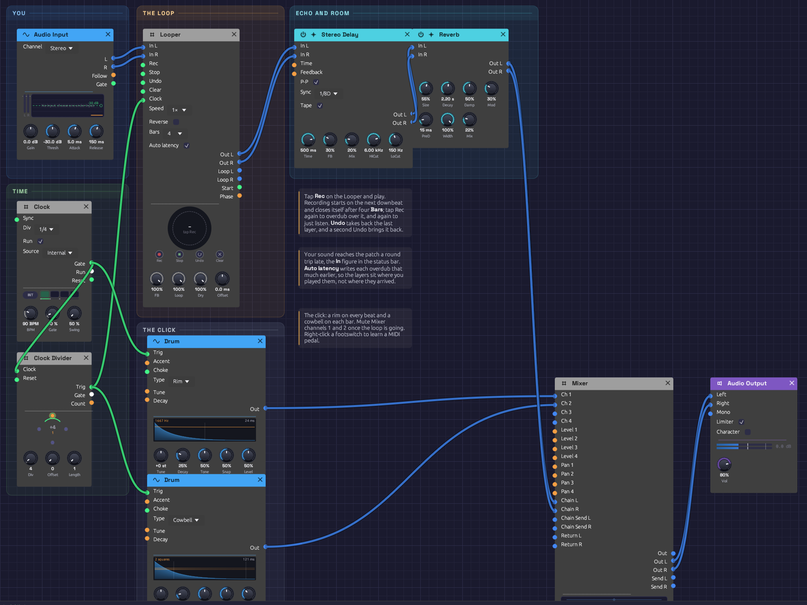

# Live Looper

Your own instrument, layered by yourself. Plug in a guitar, a microphone or a keyboard's audio out, and a [Looper](../modules/utilities/looper.md) records four bars of it on the downbeat, plays them back, and lets you play over them, layer on layer. A soft click keeps you in time, and the whole thing goes through tempo-synced echoes and a room.

> **Load it:** choose **📚 Examples → Live Looper** in the toolbar. Pick your interface under **Input** in the toolbar, press **▶ Play**, tap **Rec** on the Looper and play.
> The patch file is [`patches/live-looper.json`](https://github.com/chrischaps/Soba/blob/master/patches/live-looper.json).


*The patch as it opens. The Looper's ring is grey dashes: empty, waiting for Rec.*

## What it teaches

- **Building a piece in layers.** Record a part, then play the next over it, as a solo looping player does.
- **Takes on the beat.** The Looper's Clock is once a bar, so takes start on the downbeat and close on a bar line.
- **Latency, and taking it back.** Live sound reaches the patch late. The Looper writes each layer back by the measured round trip, so layers sit where you played them.
- **A click you can switch off.** The metronome runs into the Mixer, where two mute buttons silence it once the loop is going.

## Modules

| Module | Settings |
|--------|----------|
| [Audio Input](../modules/sources/audio-input.md) | **Channel** Stereo (choose 1 or 2 for a single instrument in one input) |
| [Clock](../modules/modulation/clock.md) | **BPM** 90, **Div** 1/4, **Gate** 10% |
| [Clock Divider](../modules/utilities/divider.md) | **Div** 4: once a bar |
| [Looper](../modules/utilities/looper.md) | **Bars** 4, **Auto latency** on, **FB** 100% |
| [Stereo Delay](../modules/effects/delay.md) | **Sync** 1/8D, **P-P** and **Tape** on, **FB** 30%, **Mix** 20%, **HiCut** 6 kHz, **LoCut** 150 Hz |
| [Reverb](../modules/effects/reverb.md) | **Size** 55%, **Decay** 2.2 s, **PreD** 15 ms, **Mod** 30%, **Mix** 22% |
| [Drum](../modules/sources/drum.md) ×2 | A **Rim** on every beat (**Decay** 25%, **Level** 50%), a **Cowbell** on each bar (**Decay** 15%, **Level** 35%) |
| [Mixer](../modules/utilities/mixer.md) | The click on channels 1 and 2 at 60%, the effects on **Return L/R** |
| [Audio Output](../modules/output/audio-output.md) | **Vol** 80% |

## How it's built

### You, into the Looper

```text
[Audio Input L] ──> [Looper In L]
[Audio Input R] ──> [Looper In R]
```

The Looper's **Out** carries what you play now and the loop together. Everything after it, echo and room, treats them as one performance.

### The bar clock

```text
[Clock Gate]         ──> [Clock Divider Clock]
[Clock Divider Trig] ──> [Looper Clock]
```

The Clock ticks quarter notes at 90 BPM. The Divider passes every fourth tick, the downbeat of each bar, to the Looper's **Clock**. A tap on **Rec** waits for the next downbeat, then records four **Bars** and closes the loop by itself: one tap to start, none to stop. A tap that lands up to 50 ms after a downbeat counts as on it.

A bar is 2.67 s at 90 BPM, so four bars are 10.7 s. Change the Clock's **BPM** before you record, and the loop is four bars at the new tempo.

### Layers

Once the loop is playing, tap **Rec** to overdub (the ring turns amber), play your next part, and tap **Rec** again when it's done. Each overdub pass lays a thin band inside the ring. **Undo** takes back the layer you just made, if it didn't work, and a second Undo brings it back. **Stop** silences the loop and **Clear** empties it to start over.

Turn **FB** down before an overdub to let the older layers fade as the new one goes on, so a loop can change gradually rather than only pile up.

### Latency

The status bar's **In** figure is the round trip from the input jack to your speakers, typically 20 to 50 ms. You play along with the loop you hear, and what you play arrives that long after the moment you were playing to. **Auto latency** writes each overdub that much earlier, so a strum on beat one lands on beat one. If layers still feel a hair late (your converters add delay no timestamp reports), trim with **Offset**.

### Click, echo and room

```text
[Clock Gate]         ──> [Drum (Rim) Trig]     ──> [Mixer Ch 1]
[Clock Divider Trig] ──> [Drum (Cowbell) Trig] ──> [Mixer Ch 2]
[Looper Out L/R] ──> [Stereo Delay In L/R] ──> [Reverb In L/R] ──> [Mixer Return L/R]
[Mixer Out L/R]  ──> [Audio Output Left/Right]
```

The click goes straight to the Mixer, never through the Looper, so it isn't recorded. Mute channels 1 and 2 when you no longer need it. The echo is a dotted eighth, ping-ponging, with tape wobble: it fills the space between a picked guitar's notes.

## Things to try

- **Learn a footswitch.** Right-click **Rec** on the Looper, choose **Learn MIDI CC**, and press a MIDI pedal. Now your hands stay on the instrument.
- **Octave down.** Set **Speed** to ½× after recording a guitar part: it becomes a bass line, twice as long.
- **Free time.** Set **Bars** to Free and unpatch the Looper's **Clock**: the loop is exactly as long as you held it, for playing out of time.
- **Effects on the loop only.** Patch **Loop L/R** through a filter or the Distortion while **Out** carries you dry.

## Rendering it offline

The `render` tool can play a recording into the Audio Input and press the footswitches from a cue script:

```text
# cues.txt: press Rec before the first downbeat; four bars record by themselves
0.5   param util.looper Pedal Rec 1
0.8   param util.looper Pedal Rec 0
14.0  param util.looper Pedal Rec 1     # overdub
14.3  param util.looper Pedal Rec 0
```

```text
cargo run --release --bin render -- patches/live-looper.json out.wav --seconds 30 --input take.wav --cue cues.txt
```
