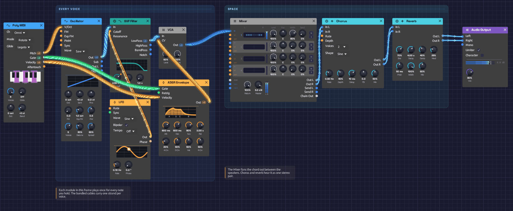

# Lush Pad

A wide, slow-blooming pad for holding chords. Each note fades in over most of a second, a filter breathes open and closed over ten seconds, the notes of a chord fan out across the stereo field, and chorus and reverb fill the space between them. This is the polyphonic example: every note you hold gets its own oscillator, filter, envelope and VCA.

> **Load it:** choose **📚 Examples → Lush Pad** in the toolbar. Press **▶ Play**, then hold chords on a MIDI keyboard or on the Z to M keys.
> The patch file is [`patches/lush-pad.json`](https://github.com/chrischaps/Modular/blob/master/patches/lush-pad.json).

<iframe class="patch-embed" src="../play/?patch=lush-pad" title="Lush Pad, playable in the browser" loading="lazy"></iframe>
*Or play it here: press **▶ Play** in the corner. The full app is a click away under **Open in Modular**.*


*The bundled cables carry one strand per voice.*

## What it teaches

- **Polyphony.** One chain of modules plays every note of a chord, each as its own voice. See [Polyphony](../concepts/polyphony.md).
- **Unison.** Several detuned copies of one oscillator make a single note sound wide and alive.
- **Mono and poly together.** A mono LFO moves every voice at once, and the effects at the end hear all the voices as one stereo pair.
- **Spreading voices.** The Mixer gives each voice of the chord its own place between the speakers.

## Modules

| Module | Settings |
|--------|----------|
| [Poly MIDI](../modules/midi/poly-midi.md) | Defaults: 8 voices, Rotate |
| [Oscillator](../modules/sources/oscillator.md) | **Wave** Saw, **Voices** 5, **Detune** 30%, **Spread** 60% |
| [SVF Filter](../modules/filters/svf-filter.md) | **Cutoff** 2.5 kHz, **Res** 15% |
| [LFO](../modules/modulation/lfo.md) | **Rate** 0.1 Hz, **Wave** Sine, **Bipolar** on |
| [ADSR Envelope](../modules/modulation/adsr.md) | **Atk** 800 ms, **Dec** 500 ms, **Sus** 80%, **Rel** 2 s |
| [VCA](../modules/utilities/vca.md) | **Level** 50% |
| [Mixer](../modules/utilities/mixer.md) | **Spread** 80%, **Master** +3 dB |
| [Chorus](../modules/effects/chorus.md) | **Rate** 0.5 Hz, **Depth** 40%, **Delay** 10 ms, **Voices** 2, **Mix** 50% |
| [Reverb](../modules/effects/reverb.md) | **Size** 70%, **Decay** 4 s, **Damp** 40%, **PreD** 50 ms, **Mix** 50% |
| [Audio Output](../modules/output/audio-output.md) | **Vol** 80% |

## How it's built

### Voices from Poly MIDI

```text
[Poly MIDI Pitch] ──> [Oscillator V/Oct]
[Poly MIDI Gate] ──> [ADSR Gate]
[Poly MIDI Velocity] ──> [ADSR Velocity]
```

Poly MIDI gives each held note a channel of its own, and these three cables carry all eight channels. The Oscillator and the ADSR are polyphonic, so they run one copy per channel: a four-note chord is four oscillators and four envelopes, each starting and releasing with its own key. Velocity reaches each note's envelope, so softer notes bloom quieter.

### One note, five saws

The Oscillator stacks five saw waves per note with **Voices** 5, detuned 30% apart. They drift in and out of phase with each other, which gives each note its slow, chorused movement before any effect is added. Only the mono **Out** is used here. The stereo width comes later, from the Mixer, the chorus and the reverb.

Five unison voices on each of eight notes is forty saws. If the patch strains your CPU, turn Poly MIDI's **Voices** down, or the Oscillator's.

### A filter that breathes

```text
[Oscillator Out] ──> [SVF Filter In]
[LFO Out] ──> [SVF Filter Cutoff]
```

The LFO takes ten seconds per cycle. The filter's **Cutoff** input works in octaves, so the bipolar LFO swings the cutoff an octave either side of 2.5 kHz, from 1.25 kHz to 5 kHz and back. The LFO is a mono cable into a polyphonic filter, so every voice's filter moves together, and the whole chord brightens and darkens as one.

### The envelope and the VCA

```text
[SVF Filter LowPass] ──> [VCA In]
[ADSR Out] ──> [VCA CV]
```

The 800 ms attack makes each note swell in rather than start, and the 2-second release lets chords overlap as you change them. Rotate allocation helps here: a released note keeps ringing on its own voice while the next chord takes fresh ones.

The VCA's **Level** sits at 50%. Voices add up, so a full chord is several times louder than one note, and the headroom keeps chords out of the limiter.

### Spreading the chord

```text
[VCA Out] ──> [Mixer Ch 1]
[Mixer Out L] ──> [Chorus In L]
[Mixer Out R] ──> [Chorus In R]
```

The Mixer hears each voice of the polyphonic cable on its own. With **Spread** at 80% it fans them out across the stereo field. Poly MIDI hands each new note the next voice, and neighbouring voices sit on opposite sides, so the notes of a chord alternate left and right. Hold a chord and watch the lights on the Mixer's panorama open out.

Panning costs a centred sound 3 dB on each side, so the Mixer's **Master** sits at +3 dB to win it back. The pad is as loud as it would be summed to mono, only wider.

### Effects

```text
[Chorus Out L] ──> [Reverb In L]
[Chorus Out R] ──> [Reverb In R]
[Reverb Out L] ──> [Audio Output Left]
[Reverb Out R] ──> [Audio Output Right]
```

The Chorus and the Reverb aren't polyphonic: they hear the chord as one stereo pair. The Chorus modulates its two sides differently, which blurs the edges between the voices, and the Reverb's long, modulated tail does the rest.

## Variations

**Brighter or darker.** Turn the filter's **Cutoff** up for a glassier pad or down to 800 Hz for a warm, distant one. The LFO keeps sweeping an octave either side of wherever you set it.

**Supersaw.** Set the Oscillator to **Voices** 7 and **Detune** 40%.

**Strings.** Shorten **Atk** to 300 ms and **Rel** to 1 s, and set the reverb's **Decay** to 2 s.

**Swell.** Lengthen **Atk** to 3 s. Hold a chord and let it rise.

**Each voice its own.** Replace the LFO's cable into the filter's **Cutoff** with Poly MIDI's **Velocity**. The filter is polyphonic, so each note's filter opens by up to an octave according to its own velocity, and harder notes come out brighter.

**Cheaper.** Set the Oscillator's **Voices** to 1 and add more chorus **Depth**. It's thinner, but costs a fifth of the CPU.

**Narrow or wide.** Turn the Mixer's **Spread** down to 0% and the chord gathers in the middle, the way it sounded before it was spread. At 100% the outer voices sit hard left and right.

## Related

- [Polyphony](../concepts/polyphony.md) – how polyphonic cables work
- [Poly MIDI](../modules/midi/poly-midi.md) – voice allocation and the sustain pedal
- [Oscillator](../modules/sources/oscillator.md#unison-and-supersaw) – unison in detail
