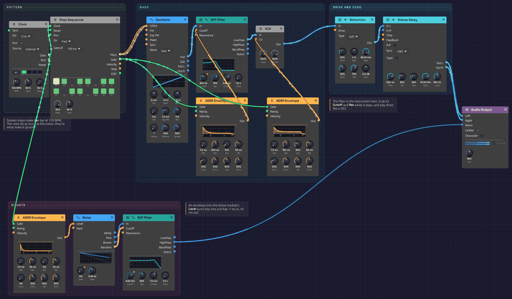

# Rhythmic Sequence

A 16-step acid bassline at 120 BPM: a saw through a resonant lowpass that snaps open on every note, warmed with distortion and pushed along by a dotted-eighth echo, over a ticking line of noise hi-hats. It plays itself, and it's built to be tweaked while it runs. Grab the filter's **Cutoff** and **Res** knobs and play them like a 303.

> **Load it:** choose **📚 Examples → Rhythmic Sequence** in the toolbar and press **▶ Play**. It needs no keyboard.
> The patch file is [`patches/rhythmic-sequence.json`](https://github.com/chrischaps/Soba/blob/master/patches/rhythmic-sequence.json).

<iframe class="patch-embed" src="../play/?patch=rhythmic-sequence" title="Rhythmic Sequence, playable in the browser" loading="lazy"></iframe>
*Or play it here: press **▶ Play** in the corner. The full app is a click away under **Open in Soba**.*


*Two envelopes from the sequencer's gate: one squelches the filter, one shapes the volume. Along the bottom, the clock plays noise hi-hats.*

## What it teaches

- **Sequencing a bassline.** Pitches, rests and an octave jump, all in one 16-step pattern.
- **The filter envelope as the instrument.** Short decay and high resonance are the sound of acid.
- **Tempo sync.** The delay locks to the Clock's tempo, so its echoes land on the beat.
- **Noise as a drum.** An envelope into a Noise module's **Level** turns hiss into a hi-hat, with no VCA needed.

## Modules

| Module | Settings |
|--------|----------|
| [Clock](../modules/modulation/clock.md) | **BPM** 120, **Div** 1/16 |
| [Step Sequencer](../modules/utilities/sequencer.md) | **Steps** 16, **Dir** Fwd, **Gate** 50%, **Gate of** 100 ms |
| [Oscillator](../modules/sources/oscillator.md) | **Wave** Saw |
| [SVF Filter](../modules/filters/svf-filter.md) | **Cutoff** 300 Hz, **Res** 70%, **CV Amt** 2 oct |
| [ADSR Envelope](../modules/modulation/adsr.md) (filter) | **Atk** 1 ms, **Dec** 200 ms, **Sus** 10%, **Rel** 50 ms |
| [ADSR Envelope](../modules/modulation/adsr.md) (amp) | **Atk** 1 ms, **Dec** 150 ms, **Sus** 30%, **Rel** 50 ms |
| [VCA](../modules/utilities/vca.md) | Defaults |
| [Distortion](../modules/effects/distortion.md) | **Type** Soft, **Drive** 30%, **Mix** 70% |
| [Stereo Delay](../modules/effects/delay.md) | **Sync** 1/8D, **FB** 30%, **Mix** 25%, **HiCut** 10 kHz, **LoCut** 300 Hz |
| [ADSR Envelope](../modules/modulation/adsr.md) (hats) | **Atk** 1 ms, **Dec** 45 ms, **Sus** 0%, **Rel** 40 ms, **A Crv** 0% |
| [Noise](../modules/sources/noise.md) | **Level** 0%, **Rate** 0.25 Hz |
| [SVF Filter](../modules/filters/svf-filter.md) (hats) | **Cutoff** 4.5 kHz, **Res** 55% |
| [Audio Output](../modules/output/audio-output.md) | **Vol** 55% |

## How it's built

### Clock and pattern

```text
[Clock Gate] ──> [Step Sequencer Clock]
[Step Sequencer Pitch] ──> [Oscillator V/Oct]
```

At 120 BPM with **Div** at 1/16, the Clock pulses four times a beat, every 125 ms, and each pulse moves the sequencer one step. The sixteen steps make one bar:

| Step | 1 | 2 | 3 | 4 | 5 | 6 | 7 | 8 | 9 | 10 | 11 | 12 | 13 | 14 | 15 | 16 |
|------|---|---|---|---|---|---|---|---|---|----|----|----|----|----|----|----|
| Note | C2 | C2 | – | G2 | C2 | – | D#2 | C2 | C3 | – | G2 | C2 | – | D#2 | F2 | G2 |

A dash is a step with its gate off: a rest. The line sits on the root, C2, and moves through notes of C minor (D# is the minor third) with an octave leap on the downbeat of the second half. The rests do as much as the notes: they're what make it groove rather than drone.

### The squelch

```text
[Oscillator Out] ──> [SVF Filter In]
[Step Sequencer Gate] ──> [ADSR (filter) Gate]
[ADSR (filter) Out] ──> [SVF Filter Cutoff]
```

The filter sits low, at 300 Hz, with **Res** at 70%. The filter envelope kicks it open on every step with a gate, then drops it back in 200 ms. That fast sweep of a sharp resonant peak is the acid sound.

The filter's **Cutoff** input works in octaves, and an envelope peaks at 1.0. The filter's **CV Amt** sets how many octaves that peak is worth: at 2, each step's envelope throws the cutoff two octaves up, to 1.2 kHz, and lets it fall back to the bass.

### Volume, drive and echo

```text
[Step Sequencer Gate] ──> [ADSR (amp) Gate]
[SVF Filter LowPass] ──> [VCA In]
[ADSR (amp) Out] ──> [VCA CV]
[VCA Out] ──> [Distortion In]
[Distortion Out] ──> [Stereo Delay In L]
[Stereo Delay Out L] ──> [Audio Output Left]
[Stereo Delay Out R] ──> [Audio Output Right]
```

The amp envelope is short and punchy, so each note is a distinct pluck. With **Gate** at 50%, each of the sequencer's gates lasts 50 ms (**Gate of** is set to 100 ms, so Gate is a share of a fixed 100 ms), well inside the 125 ms step.

Soft distortion at 30% drive, mixed at 70%, rounds and thickens the bass and makes the resonant peak growl.

The Stereo Delay's **Sync** is set to 1/8D, a dotted eighth. It takes its tempo from the Clock, so at 120 BPM each echo comes 375 ms after its note: three sixteenths later, falling between the notes and filling the gaps. Its **LoCut** keeps the echoes out of the bass register, so they don't muddy the line.

### Hi-hats

```text
[Clock Gate] ──> [ADSR (hats) Gate]
[ADSR (hats) Out] ──> [Noise Level]
[Noise Pink] ──> [SVF Filter (hats) In]
[Noise Random] ──> [SVF Filter (hats) Cutoff]
[SVF Filter (hats) HighPass] ──> [Audio Output Mono]
```

The hats take the Clock's pulse directly, so they tick on every sixteenth whether or not the bassline plays. That steady pulse under the rests is what makes the line swing.

The Noise module's **Level** knob is at 0, so it is silent until the envelope opens it. Each pulse snaps it to full in 1 ms and lets it die away in 45 ms: a short burst of noise, which is all a closed hi-hat is. An envelope into **Level** does the job of a VCA, and Level follows CV instantly, so the attack stays sharp.

The highpass filter at 4.5 kHz keeps only the sizzle. Pink noise rather than white keeps the hats from getting harsh and sitting on top of the bass. Noise's **Random** output drifts the filter's cutoff an octave either way, over several seconds, so the hats darken and brighten as if a drummer were working the pedal. The hats go to **Mono**, past the delay, so they stay dry and tight in the middle.

## Variations

**Play the filter.** While it runs, sweep **Cutoff** between 150 Hz and 1 kHz and push **Res** toward 90%. Lengthen the filter envelope's **Dec** to 400 ms for longer squelches, and turn **CV Amt** up to 3 or 4 for wider ones.

**Change the line.** Click a step to toggle its gate. Drag a step up or down to change its note, or right-click it and play a new line on its piano: each key writes a step and moves to the next.

**Different tempo.** Turn the Clock's **BPM**. The delay follows, staying on the dotted eighth.

**Slide.** Patch the sequencer's **Pitch** through a [Slope](../modules/modulation/slope.md) on its way to the Oscillator's **V/Oct**, with **Rise** and **Fall** at 60 ms and **Shape** at 0. Every note now slides into the next: the octave leap to C3 in 60 ms, a fifth in 35 ms, so each slide is over well inside its step and the line still lands on its notes. Repeated notes don't slide, so the pattern keeps its stabs. Turn **Rise** and **Fall** up to 200 ms for a lazier, more vocal line.

**Shorter loop.** Set **Steps** to 12 or 7 for a pattern that cycles against the bar.

**Fatter.** Swap the SVF for a [Ladder Filter](../modules/filters/ladder-filter.md) and use its **LP24** output. Raise its **Drive** to 3x.

**Harder.** Set the Distortion's **Type** to Hard or Fold and raise **Drive**. Turn **Out** down to keep the level in check.

**Open hats.** Raise the hat envelope's **Dec** to 250 ms, so each hat rings into the next and the line turns to a shimmering wash. Switch the filter to **BandPass** for a trashier, more metallic hat.

## Related

- [Clock](../modules/modulation/clock.md) – tempo and divisions
- [Step Sequencer](../modules/utilities/sequencer.md) – editing steps
- [Noise](../modules/sources/noise.md) – the hi-hats' source, and what else it can do
- [Generative Ambient](./generative-ambient.md) – the same clock and sequencer, slowed right down
- [Shoreline](./shoreline.md) – noise as surf, and as the chooser of notes
