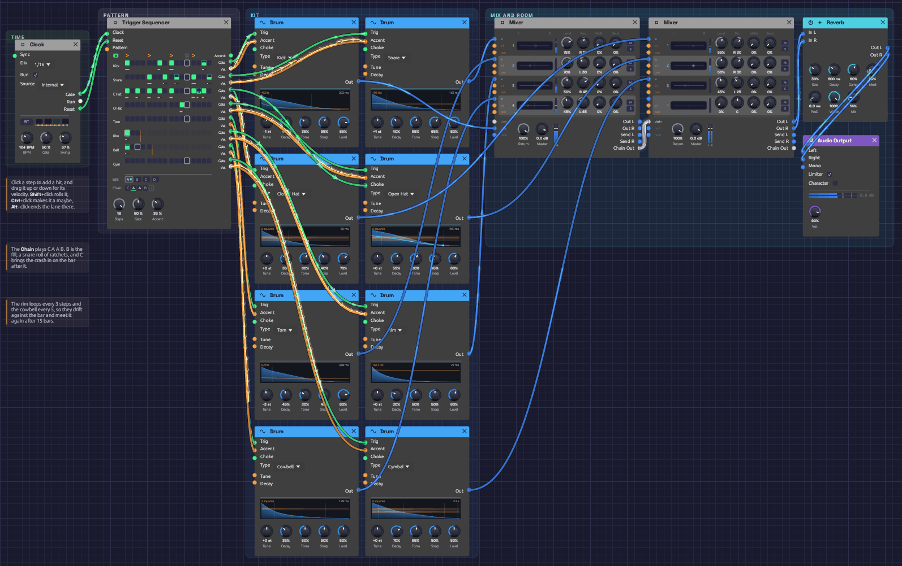

# Roll Call

A full drum kit on one [Trigger Sequencer](../modules/utilities/trigger-sequencer.md): eight [Drum](../modules/sources/drum.md) voices, each on its own lane, with ghost notes, hat rolls, a snare-roll fill every fourth bar and a crash on the bar after it. The whole patch is 14 modules. [Drum Machine](./drum-machine.md) needs a Step Sequencer for every drum to play five; here one module plays eight, and changes pattern for the fill by itself. It plays itself; press Play and let it run.

> **Load it:** choose **📚 Examples → Roll Call** in the toolbar and press **▶ Play**. It needs no keyboard.
> The patch file is [`patches/roll-call.json`](https://github.com/chrischaps/Soba/blob/master/patches/roll-call.json).

<iframe class="patch-embed" src="../play/?patch=roll-call" title="Roll Call, playable in the browser" loading="lazy"></iframe>
*Or play it here: press **▶ Play** in the corner. The full app is a click away under **Open in Soba**.*


*The Clock, then the Trigger Sequencer, whose eight lanes fan out to the kit two drums at a time: kick and snare, closed and open hat, tom and rim, cowbell and cymbal. Two Mixers, a room and the output sit at the right.*

## What it teaches

- **One sequencer, a whole kit.** Each lane's **Gate** strikes a Drum and its **Vel** sets the Drum's **Accent**. The lanes take their names from the drums they play.
- **Patterns in a chain.** The Chain plays `C A A B`: the groove twice, a fill, and the groove with a crash. Every change lands on a bar line.
- **Ratchets.** Rolls are single steps split into two, three or four hits.
- **Probability.** Some ghost notes and hat rolls play only some of the time, so the loop never quite repeats.
- **Polymeter.** The rim loops every 3 steps and the cowbell every 5, against a 16-step bar.

## The patterns

Sixteen steps a bar at 104 BPM, swung at 57%. `X` is a full hit, `x` a softer one, `g` a ghost note, `?` a hit that plays only sometimes. A digit is a ratchet, that many hits in the step. `>` marks an accent.

**A**, the groove:

```text
step     1 . . . 5 . . . 9 . . . 13. . .
accent   > . . . > . . . > . . . > . . .
kick     X . . . . . x . X . . . . . ? .
snare    . . . . X . . g . ? . . X . . ?
c hat    X . x . X . x . X . . . X 3 x .
o hat    . . . . . . . . . . x . . . . .
```

The closed hats' roll on step 14 plays three soft hits, 40% of the time. The kick's pickup on 15 and the snare's ghosts on 10 and 16 come and go too.

**B**, the fill, keeps the first half of the groove and turns the rest into a roll:

```text
step     1 . . . 5 . . . 9 . . . 13. . .
accent   > . . . > . . . > . . . > . . >
kick     X . . . . . x . X . . . . . . .
snare    . . . . X . . g . . 2 2 3 3 4 4
tom      . . . . . . . . . x . x . . . .
c hat    X . x . X . x . X . . . . . . .
```

The snare roll builds from soft doubles to full fours, and two toms answer it. The last step is accented, a push into the downbeat.

**C** is A with a crash on the downbeat. Coming round after B, it lands where a drummer's crash would.

The rim plays one quiet hit every 3 steps, and the cowbell one every 5, three times in four. Neither fits a bar of 16, so they fall on different steps every bar and line up with it again only after 15 bars, while the groove underneath stays put.

## Modules

| Module | Settings |
|--------|----------|
| [Clock](../modules/modulation/clock.md) | **BPM** 104, **Div** 1/16, **Gate** 50%, **Swing** 57% |
| [Trigger Sequencer](../modules/utilities/trigger-sequencer.md) | **Steps** 16, **Gate** 50%, **Accent** 35%. Chain `C A A B`. Rim lane 3 steps long, cowbell lane 5 |
| [Drum](../modules/sources/drum.md) (kick) | **Type** Kick, **Tune** -1 st, **Decay** 45%, **Tone** 35%, **Snap** 55%, **Level** 85% |
| [Drum](../modules/sources/drum.md) (snare) | **Type** Snare, **Tune** +1 st, **Decay** 40%, **Tone** 55%, **Snap** 65%, **Level** 80% |
| [Drum](../modules/sources/drum.md) (closed hat) | **Type** Closed Hat, **Decay** 35%, **Tone** 60%, **Snap** 40%, **Level** 70% |
| [Drum](../modules/sources/drum.md) (open hat) | **Type** Open Hat, **Decay** 55%, **Tone** 60%, **Snap** 45%, **Level** 60% |
| [Drum](../modules/sources/drum.md) (tom) | **Type** Tom, **Tune** -3 st, **Decay** 45%, **Tone** 30%, **Snap** 40%, **Level** 80% |
| [Drum](../modules/sources/drum.md) (rim) | **Type** Rim, **Decay** 30%, **Tone** 50%, **Snap** 50%, **Level** 60% |
| [Drum](../modules/sources/drum.md) (cowbell) | **Type** Cowbell, **Decay** 35%, **Tone** 50%, **Snap** 50%, **Level** 50% |
| [Drum](../modules/sources/drum.md) (cymbal) | **Type** Cymbal, **Decay** 70%, **Tone** 55%, **Snap** 50%, **Level** 50% |
| [Mixer](../modules/utilities/mixer.md) (skins) | Snare 75% at R 10, tom 70% at L 30, rim 50% at R 45, cowbell 45% at L 45; the kick on **Return L** |
| [Mixer](../modules/utilities/mixer.md) (metal) | Closed hat 55% and open hat 50% at R 30, cymbal 45% at L 25; the skins Mixer on **Chain In** |
| [Reverb](../modules/effects/reverb.md) | **Size** 30%, **Decay** 0.6 s, **Damp** 60%, **PreD** 8 ms, **Mix** 14% |
| [Audio Output](../modules/output/audio-output.md) | **Vol** 90% |

## How it's built

### Eight lanes

```text
[Clock Gate]  ──> [Trigger Sequencer Clock]
[Clock Reset] ──> [Trigger Sequencer Reset]
[Trigger Sequencer Gate n] ──> [Drum n Trig]
[Trigger Sequencer Vel n]  ──> [Drum n Accent]
[Trigger Sequencer Gate 3] ──> [Open Hat Choke]
```

Every lane is two cables to its Drum. The closed hat's **Gate** also chokes the open hat, so the open hat on step 11 rings only until the closed hat on 13.

Accents raise the velocity of every hit on beats 1 to 4 a third of the way to full, so the downbeats lean forward without any lane being louder overall.

### Two mixers

Five drums go to the first Mixer: the kick on its **Return L**, which puts it in the centre, and the snare, tom, rim and cowbell on its four channels. That Mixer's **Chain Out** comes into the second one's **Chain In**, on one cable, and the second adds the hats and the cymbal and sends the whole kit through a small room.

## Try this

**Edit the groove.** Click a pad to add or remove a hit, drag it for velocity, or Shift + click it for a roll. Each change is one undo step.

**Write your own fill.** Right-click the **A** tab and copy it to **D**. Change D's last bar-quarter, then click the Chain's last bar until it reads **D**.

**Longer phrases.** Click **+** under the Chain to add bars. `C A A B A A A B` waits eight bars for the crash.

**Straight time.** Turn the Clock's **Swing** to 50% for a programmed feel, or 62% for a lazier one.

**A different polymeter.** Right-click the rim's name and pick 7: its figure now meets the bar after 7 bars.

**Choose the pattern by hand.** Patch an [Attenuverter](../modules/utilities/attenuverter.md)'s output into **Pattern** and turn its **Offset**: 0 plays A, 0.3 plays B, 0.6 plays C. The change waits for the next bar.

## Related

- [Trigger Sequencer](../modules/utilities/trigger-sequencer.md) – the grid, the Chain, ratchets, probability and polymeter
- [Drum](../modules/sources/drum.md) – each type, what its knobs do, and how a choke works
- [Drum Machine](./drum-machine.md) – a kit on five Step Sequencers, with tuned toms
- [Clock](../modules/modulation/clock.md) – tempo and swing
