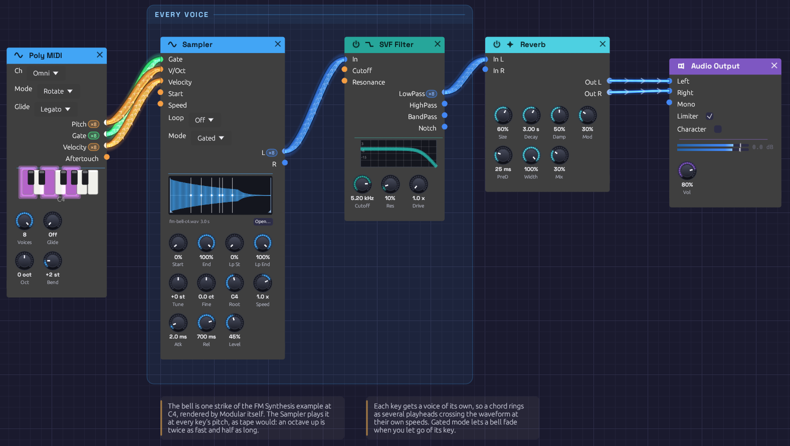

# Sampled Keys

A bell you can play across the keyboard, made from one recorded note. The recording is a single strike of the [FM Synthesis](./fm-synthesis.md) bell at middle C, rendered by Modular itself. A Sampler plays it back faster for higher keys and slower for lower ones, a voice for every key you hold, through a filter and a room.

> **Load it:** choose **📚 Examples → Sampled Keys** in the toolbar. Press **▶ Play**, then hold chords on a MIDI keyboard or on the Z to M keys.
> The patch file is [`patches/sampled-keys.json`](https://github.com/chrischaps/Modular/blob/master/patches/sampled-keys.json), and its sample is [`patches/samples/fm-bell-c4.wav`](https://github.com/chrischaps/Modular/blob/master/patches/samples/fm-bell-c4.wav).

<iframe class="patch-embed" src="../play/?patch=sampled-keys" title="Sampled Keys, playable in the browser" loading="lazy"></iframe>
*Or play it here: press **▶ Play** in the corner. The full app is a click away under **Open in Modular**.*


*A chord on the bell: each white line on the waveform is a key, playing the recording at its own speed.*

## What it teaches

- **Sampling.** A recording becomes an instrument. One note, played faster or slower, covers the whole keyboard.
- **Pitch is speed.** As on tape, an octave up plays twice as fast and lasts half as long. The bell rings shorter at the top of the keyboard and longer at the bottom, as real ones do.
- **Polyphony from one module.** The Sampler runs a voice for every channel of Poly MIDI's cables.
- **Resampling with Modular itself.** The bell was rendered from another example with the `render` tool, so the sample has no licence to worry about.

## Modules

| Module | Settings |
|--------|----------|
| [Poly MIDI](../modules/midi/poly-midi.md) | Defaults: 8 voices, Rotate |
| [Sampler](../modules/sources/sampler.md) | `samples/fm-bell-c4.wav`, **Mode** Gated, **Root** C4, **Rel** 700 ms, **Level** 45% |
| [SVF Filter](../modules/filters/svf-filter.md) | **Cutoff** 5.2 kHz, **Res** 10% |
| [Reverb](../modules/effects/reverb.md) | **Size** 60%, **Decay** 3 s, **Damp** 50%, **PreD** 25 ms, **Mod** 30%, **Mix** 30% |
| [Audio Output](../modules/output/audio-output.md) | **Vol** 80% |

## How it's built

### Keys into the Sampler

```text
[Poly MIDI Pitch]    ──> [Sampler V/Oct]
[Poly MIDI Gate]     ──> [Sampler Gate]
[Poly MIDI Velocity] ──> [Sampler Velocity]
```

Poly MIDI gives each held key a channel of its own. The Sampler plays each channel as a separate voice, starting the recording from the top when that key goes down. **Root** is C4, the note the bell was struck at, so C4 plays the recording exactly as it is. D4 plays it 12% faster, and C5 twice as fast.

**Mode** is Gated: letting go of a key lets its bell go over **Rel**, 700 ms. In One-Shot mode every strike would ring its full three seconds, however briefly you touched the key.

Velocity sets each note's level as it starts, so a soft touch rings quietly.

### The sample

The bell comes from the FM Synthesis example. Its Keyboard was swapped for a Clock to strike it once, held two seconds, and the `render` tool recorded it at 44.1 kHz. The result was trimmed to three seconds, peaked at -1 dBFS and saved as 16-bit mono. The Sampler resamples it to your device's rate when it loads.

The patch names its sample by a path relative to itself, `samples/fm-bell-c4.wav`. Save the example somewhere and **Save As** copies the bell into a `samples` folder beside your copy.

### Filter and room

```text
[Sampler L]          ──> [SVF Filter In]
[SVF Filter LowPass] ──> [Reverb In L]
[Reverb Out L]       ──> [Audio Output Left]
[Reverb Out R]       ──> [Audio Output Right]
```

Played above its root, the bell's top harmonics climb high, and past an octave or so they begin to alias. The filter at 5.2 kHz takes the edge off. It's polyphonic, a filter per voice. The Reverb hears the voices summed, and spreads its tail across both speakers.

## Variations

**A different instrument.** Click **Open…** on the Sampler and load a recording of your own: a piano note, a sung "ah", a guitar chord. Set **Root** to the note it was recorded at.

**Music box.** Set **Tune** to +12 and **Rel** to 2 s. Short, high, and ringing on.

**Endless bell.** Set **Loop** to Ping-Pong, drag the loop markers over the steady part of the ring (about 30% to 60%), and set **Rel** to 3 s. Held keys now sustain like an organ.

**Tape warble.** Patch a slow [LFO](../modules/modulation/lfo.md) (about 0.3 Hz) through an [Attenuverter](../modules/utilities/attenuverter.md) at 2% into the Sampler's **Speed**. The whole chord wavers in pitch, like a stretched tape.

**Reverse.** Set **Speed** to −1. Each key plays the bell backwards, swelling up to the strike.

## Related

- [Sampler](../modules/sources/sampler.md): loading files, loops, and how patches keep their samples
- [FM Synthesis](./fm-synthesis.md): where the bell comes from
- [Polyphony](../concepts/polyphony.md): how one module plays every voice
