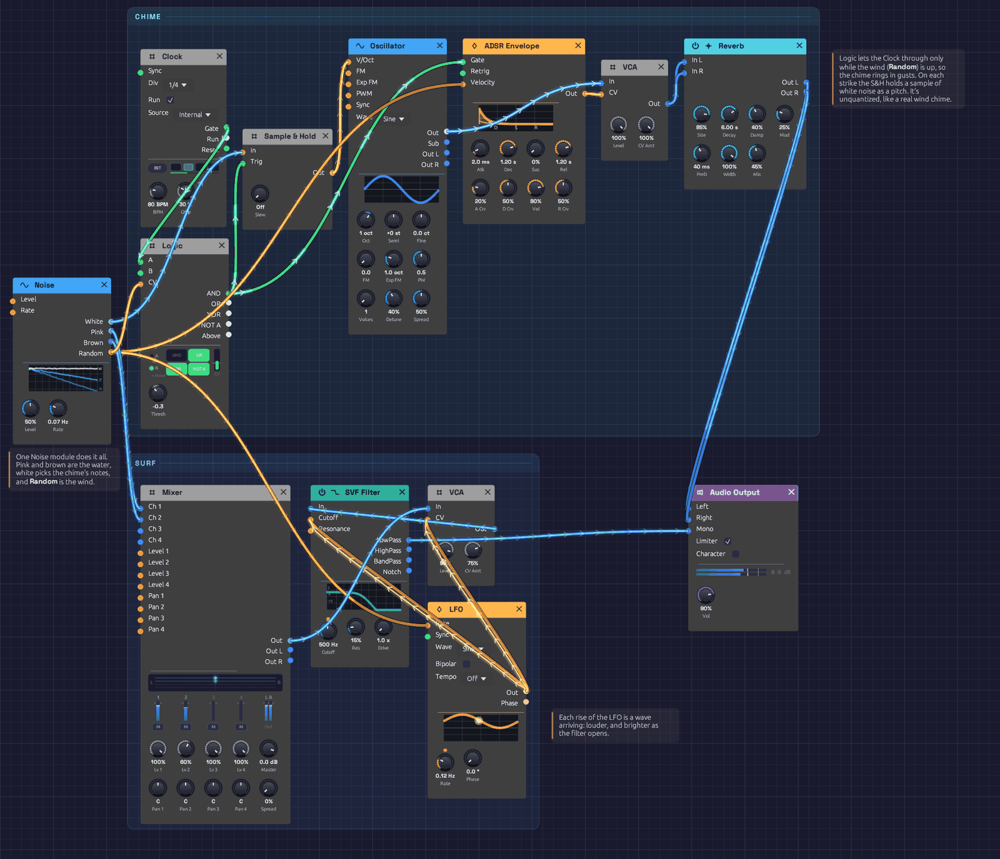

# Shoreline

Surf rolls in and draws back, and a glass chime somewhere up the beach turns in the wind. Nothing here is a recording, and nothing repeats: a single [Noise](../modules/sources/noise.md) module makes the water, decides when each wave arrives, and picks every note the chime plays. It plays itself; press Play and let it run.

> **Load it:** choose **📚 Examples → Shoreline** in the toolbar and press **▶ Play**. It needs no keyboard.
> The patch file is [`patches/shoreline.json`](https://github.com/chrischaps/Modular/blob/master/patches/shoreline.json).

<iframe class="patch-embed" src="../play/?patch=shoreline" title="Shoreline, playable in the browser" loading="lazy"></iframe>
*Or play it here: press **▶ Play** in the corner. The full app is a click away under **Open in Modular**.*


*The chime runs along the top and the surf along the bottom. The Noise module on the left feeds both.*

## What it teaches

- **Noise as sound.** Pink and brown noise through a moving lowpass filter make convincing surf.
- **Noise as decision.** White noise, sampled on a clock, chooses notes. Noise's smooth **Random** output decides how fast the waves come, whether the chime rings at all, and how hard it's struck.
- **One source, many voices.** Every output of the Noise module is patched, and each does a different job. Because one random signal drives both the waves and the chime, the two move together: when the wind picks up, the waves come quicker and the chime starts to ring. When it drops, the chime falls silent.

## Modules

| Module | Settings |
|--------|----------|
| [Noise](../modules/sources/noise.md) | **Level** 50%, **Rate** 0.07 Hz |
| [Clock](../modules/modulation/clock.md) | **BPM** 80, **Div** 1/4, **Gate** 30% |
| [Logic](../modules/utilities/logic.md) | **Thresh** -0.3, nothing in **B** |
| [Sample & Hold](../modules/utilities/sample-hold.md) | Defaults (no slew) |
| [Oscillator](../modules/sources/oscillator.md) | **Wave** Sine, **Oct** +1 |
| [ADSR Envelope](../modules/modulation/adsr.md) | **Atk** 2 ms, **Dec** 1.2 s, **Sus** 0%, **Rel** 1.2 s, **Vel** 80% |
| [VCA](../modules/utilities/vca.md) (chime) | Defaults |
| [Reverb](../modules/effects/reverb.md) | **Size** 85%, **Decay** 6 s, **Damp** 40%, **PreD** 40 ms, **Mix** 45% |
| [LFO](../modules/modulation/lfo.md) | **Rate** 0.12 Hz, **Wave** Sine, **Bipolar** off |
| [Mixer](../modules/utilities/mixer.md) | **Lv 1** 100%, **Lv 2** 60% |
| [VCA](../modules/utilities/vca.md) (surf) | **Level** 90%, **CV Amt** 75% |
| [SVF Filter](../modules/filters/svf-filter.md) | **Cutoff** 500 Hz, **Res** 15% |
| [Audio Output](../modules/output/audio-output.md) | **Vol** 80% |

## How it's built

### The surf

```text
[Noise Pink]  ──> [Mixer Ch 1]
[Noise Brown] ──> [Mixer Ch 2]
[Mixer Out] ──> [VCA (surf) In]
[VCA (surf) Out] ──> [SVF Filter In]
[SVF Filter LowPass] ──> [Audio Output Mono]
```

Pink noise has the even, rushing quality of water. Brown noise, mixed in a little lower, adds the deep rumble underneath. The lowpass filter at 500 Hz takes off the hiss and leaves something that sounds far away.

### The waves

```text
[LFO Out] ──> [VCA (surf) CV]
          ──> [SVF Filter Cutoff]
```

The LFO is a slow, unipolar sine, so it rises from 0 to 1 and falls back about every eight seconds. Each rise is a wave arriving. On the VCA, with **CV Amt** at 75%, it swells the surf by about 12 dB and never quite silences it. On the filter's **Cutoff**, which works in octaves, it opens the filter from 500 Hz to 1 kHz. A wave gets brighter as it gets louder, the way a breaker's hiss arrives with its roar.

### No two waves alike

```text
[Noise Random] ──> [LFO Rate]
```

On its own the LFO would be a metronome. Noise's **Random** output wanders smoothly between -1 and 1, choosing a new value about every fourteen seconds (**Rate** 0.07 Hz). Patched into the LFO's **Rate**, each +1 doubles the wave speed and each -1 halves it. Waves now arrive anywhere from every four seconds to every seventeen, in calm stretches and busy ones.

### The chime

```text
[Logic AND] ──> [Sample & Hold Trig]
[Noise White] ──> [Sample & Hold In]
[Sample & Hold Out] ──> [Oscillator V/Oct]
[Logic AND] ──> [ADSR Gate]
[Oscillator Out] ──> [VCA (chime) In]
[ADSR Out] ──> [VCA (chime) CV]
```

This is the classic random melody. On each pulse that reaches it, at most every 0.75 seconds, the Sample & Hold catches the white noise and holds it as a pitch. With Noise **Level** at 50%, the pitches land anywhere within half an octave of C5. They're unquantized, falling between the keys of a piano, which suits a wind chime: real chimes are seldom tuned to a scale. The sine wave, a 2 ms strike and a 1.2-second ring make it sound like glass.

### The wind

```text
[Clock Gate] ──> [Logic A]
[Noise Random] ──> [Logic CV]
[Noise Random] ──> [ADSR Velocity]
```

A real wind chime doesn't ring on a beat. It rings when the wind blows, and hangs still when it drops. The Clock's pulses pass through a [Logic](../modules/utilities/logic.md) module first. Noise's **Random**, the wind, goes into its **CV**, and nothing goes into **B**, so B is Logic's own **Above**: high while the wind is above the **Threshold** of -0.3. **AND** lets a clock pulse through only then. Through the calms, ten or twenty seconds at a time, the chime hangs silent and only the surf moves.

The same **Random** also sets how hard each strike lands. With **Vel** at 80%, a strike while Random is high rings at full level. One just over the threshold rings at about a fifth of that. So a gust doesn't switch the chime on: it fades in with a few faint ticks, swells, and fades out again. The gusts come with the faster waves, because the same wind sets the waves' speed.

### Space

```text
[VCA (chime) Out] ──> [Reverb In L]
                  ──> [Reverb In R]
[Reverb Out L] ──> [Audio Output Left]
[Reverb Out R] ──> [Audio Output Right]
```

A large, six-second reverb spreads the chime across the stereo field and blurs each note into the next. The surf skips the reverb and goes straight to **Mono**. That keeps the water close and the chime farther off.

## Variations

**Stormier.** Raise the LFO's **Rate** to 0.3 Hz and the filter's **Res** to 40%. Swap Ch 1 and Ch 2 levels on the Mixer for a heavier, browner sea.

**A wider chime.** Turn Noise **Level** up to 100% and the chime ranges a full octave either way. The surf gets louder too, so lower the surf VCA's **Level** to match.

**Gentler wind.** Lower the ADSR's **Vel** to 40% so calm and gusty strikes differ less.

**Stiller or windier.** Raise Logic's **Thresh** to 0 and the chime rings only in the stronger half of the gusts, with long calms between. Lower it to -1 and it rings on nearly every beat, whatever the wind.

**Glide.** Raise the Sample & Hold's **Slew** to 50 ms and the chime bends between notes, more like a singing bowl than a bell.

**A tuned chime.** Patch a [Quantizer](../modules/utilities/quantizer.md) between the Sample & Hold and the Oscillator, set to Pentatonic Major. The chime now plays notes of a scale, like a set of tuned bells.

**A shimmer.** Set the Oscillator's **Voices** to 3 and **Detune** to 10%. Each strike now beats slowly against itself, like a long metal tube.

## Related

- [Noise](../modules/sources/noise.md) – every output used here, explained
- [Sample & Hold](../modules/utilities/sample-hold.md) – turning noise into notes
- [Generative Ambient](./generative-ambient.md) – variety from cycles that don't line up, and chance kept in key
- [Rhythmic Sequence](./rhythmic-sequence.md) – noise as a hi-hat
