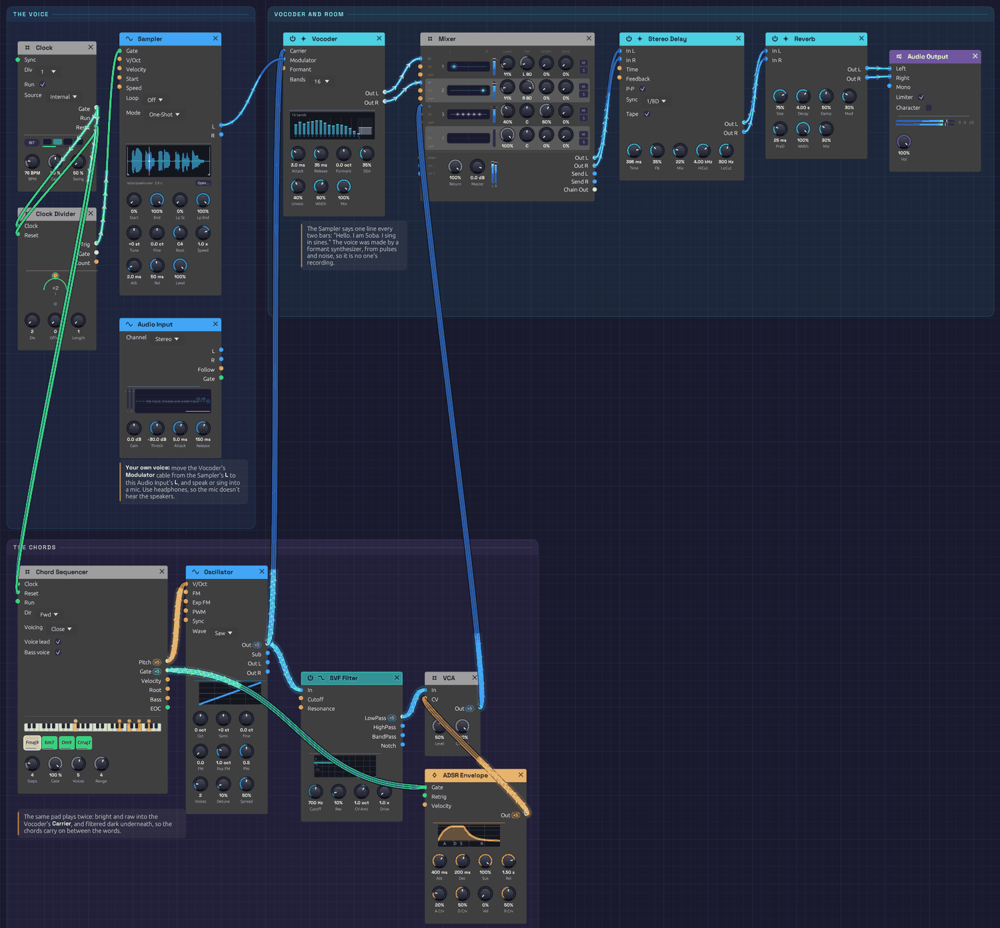

# Soba Speaks

A patch that talks. Every two bars a voice says *"Hello. I am Soba. I sing in sines."* You don't hear the voice itself. You hear a chord of saws wearing its vowels and consonants, through a [Vocoder](../modules/effects/vocoder.md). The chords fall a step a bar, Fmaj9, Em7, Dm9, Cmaj7, and a soft pad of the same chords carries on between the words. Move one cable and it speaks with your voice instead.

> **Load it:** choose **📚 Examples → Soba Speaks** in the toolbar and press **▶ Play**. It needs no keyboard.
> The patch file is [`patches/soba-speaks.json`](https://github.com/chrischaps/Soba/blob/master/patches/soba-speaks.json), and its voice is [`patches/samples/soba-speaks.wav`](https://github.com/chrischaps/Soba/blob/master/patches/samples/soba-speaks.wav).

<iframe class="patch-embed" src="../play/?patch=soba-speaks" title="Soba Speaks, playable in the browser" loading="lazy"></iframe>
*Or play it here: press **▶ Play** in the corner. The full app is a click away under **Open in Soba**.*


*The voice is on the left, the vocoder and its room run along the top, and the chords run along the bottom. One oscillator feeds both the vocoder's **Carrier** and the dark pad.*

## What it teaches

- **Carrier and modulator.** A vocoder has two inputs, and they do different jobs. The **Modulator** says *what* is said: the voice's changing spectrum. The **Carrier** says *what it's said with*: its pitch, its chord, its tone.
- **A sample that plays itself.** A Sampler in One-Shot mode, fired by a Clock Divider every two bars, makes a recorded line part of the song.
- **A whole chord on one cable.** The Chord Sequencer sends five voices down one polyphonic cable. The Vocoder sums them into one carrier, so the voice speaks in harmony.
- **One oscillator, two jobs.** The same saw chord goes raw into the vocoder, which needs its highs, and filtered dark into a pad underneath.
- **Stereo bands.** The Vocoder's odd bands lean left and its even bands lean right. Two Mixer strips, panned apart, keep the spread.

## Modules

| Module | Settings |
|--------|----------|
| [Clock](../modules/modulation/clock.md) | **BPM** 76, **Div** 1 (a pulse every bar) |
| [Clock Divider](../modules/utilities/divider.md) | **Div** 2 (every other bar) |
| [Sampler](../modules/sources/sampler.md) | `samples/soba-speaks.wav`, **Mode** One-Shot, **Atk** 2 ms, **Rel** 50 ms, **Level** 100% |
| [Audio Input](../modules/sources/audio-input.md) | Defaults, unpatched: for your own voice |
| [Chord Sequencer](../modules/utilities/chord-sequencer.md) | **Steps** 4, **Gate** 100%, **Voices** 5, **Range** 4, **Voicing** Close, **Voice lead** on, **Bass voice** on. Chords Fmaj9 (F3), Em7 (E3), Dm9 (D3), Cmaj7 (C3) |
| [Oscillator](../modules/sources/oscillator.md) | **Wave** Saw, **Voices** 2, **Detune** 10%, **Spread** 50% |
| [SVF Filter](../modules/filters/svf-filter.md) | **Cutoff** 700 Hz, **Res** 10% |
| [VCA](../modules/utilities/vca.md) | **Level** 50% |
| [ADSR Envelope](../modules/modulation/adsr.md) | **Atk** 400 ms, **Dec** 200 ms, **Sus** 100%, **Rel** 1.5 s, **Vel** 0% |
| [Vocoder](../modules/effects/vocoder.md) | **Bands** 16, **Attack** 3 ms, **Release** 35 ms, **Formant** 0, **Sibil** 35%, **Unvoic** 40%, **Width** 60%, **Mix** 100% |
| [Mixer](../modules/utilities/mixer.md) | **Level 1** and **Level 2** 11%, **Pan 1** L 80, **Pan 2** R 80. **Level 3** 40%, **Width 3** 60% |
| [Stereo Delay](../modules/effects/delay.md) | **Sync** 1/8D, **FB** 35%, **Mix** 22%, **HiCut** 4 kHz, **LoCut** 300 Hz, **P-P** on, **Tape** on |
| [Reverb](../modules/effects/reverb.md) | **Size** 75%, **Decay** 4 s, **PreD** 25 ms, **Mix** 30%, **Mod** 30% |
| [Audio Output](../modules/output/audio-output.md) | **Vol** 100%, **Limiter** on |

## How it's built

### The voice

```text
[Clock Gate] ──> [Clock Divider Clock]
[Clock Divider Trig] ──> [Sampler Gate]
[Sampler L] ──> [Vocoder Modulator]
```

The Clock pulses once a bar. The Clock Divider passes every second pulse to the Sampler, which plays its recording from the start in One-Shot mode, to the end whatever the gate does. The line lasts just under four seconds, a bar and a quarter at 76 BPM. Its last word, *sines*, lands on the change to the second chord.

The voice isn't anyone's recording. It was made for this example by a small formant synthesizer, [`tools/voice/speak.py`](https://github.com/chrischaps/Soba/blob/master/tools/voice/speak.py). A pulse train at a speaking pitch, shaped like the airflow through the vocal folds, runs through a chain of resonators. The lowest three glide from sound to sound: they're the formants that make an "ah" an "ah". The "s" sounds are filtered noise. To a vocoder, that's all a voice is: formants that move, and hiss.

### The chords

```text
[Clock Gate] ──> [Chord Sequencer Clock]
[Chord Sequencer Pitch] ──> [Oscillator V/Oct]
[Oscillator Out] ──> [Vocoder Carrier]
                 ──> [SVF Filter In]
[SVF Filter LowPass] ──> [VCA In]
[Chord Sequencer Gate] ──> [ADSR Gate]
[ADSR Out] ──> [VCA CV]
```

The Chord Sequencer steps once a bar through four chords that fall by step: Fmaj9, Em7, Dm9, Cmaj7. With **Voice lead** on, each chord moves to the nearest notes of the next, so the harmony glides down instead of jumping. Five voices of two detuned saws each give the vocoder a carrier rich in highs, all the way up through its top bands.

The same chord goes through the SVF Filter at 700 Hz into a VCA that swells with each chord. That's the pad underneath: dark enough not to compete with the words, and still there when the voice is silent.

### The vocoder and the room

```text
[Vocoder Out L] ──> [Mixer Ch 1]   (panned L 80)
[Vocoder Out R] ──> [Mixer Ch 2]   (panned R 80)
[VCA Out] ──> [Mixer Ch 3]
[Mixer Out L/R] ──> [Stereo Delay] ──> [Reverb] ──> [Audio Output]
```

The Vocoder splits the voice into 16 bands, from 100 Hz to 6.4 kHz. Each band's level opens the matching band of the chord. **Attack** 3 ms and **Release** 35 ms are fast enough for speech, so each syllable starts and stops cleanly. **Sibilance** lets the voice's own "s" sounds through on top, and **Unvoiced** puts noise in the carrier's place while the voice hisses, so the consonants stay readable.

A five-note chord is loud, so the vocoder's strips sit at 11%. The ping-pong echo answers each phrase from the other side, and the reverb puts the voice and the pad in one room.

## Try this

- **Speak into it.** Move the Vocoder's **Modulator** cable from the Sampler's **L** to the Audio Input's **L**, pick your microphone under **Input** in the toolbar, and talk or sing. Wear headphones, or the mic hears the speakers. Sustained vowels make the chords bloom. A whisper comes through as hiss.
- **Robot.** Set **Bands** to 8 and **Release** to 20 ms.
- **Choir.** Set **Bands** to 24 and **Release** to 600 ms. The words smear into a choir that holds each vowel.
- **Change the throat.** Turn **Formant** up to +0.5 oct for a small, bright voice, or down to −0.5 oct for a giant. The pitch stays the chord's. Patch a slow [LFO](../modules/modulation/lfo.md) into the **Formant** input and the voice keeps changing size.
- **A whisper.** Patch [Noise](../modules/sources/noise.md) (white) into **Carrier** in place of the oscillator. The voice comes back with no pitch at all.
- **Hear what the vocoder hears.** Bypass the Vocoder (**Ctrl+B**) and you hear the raw saw chord it's been shaping all along.
